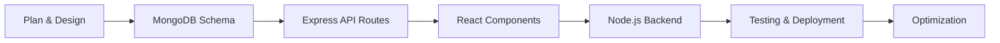

<div align="center">
  
# 👋 Hey there, I'm Gaurav Singh


</div>


### 🚀 About Me

- 💼 **Full Stack Web Developer** specializing in **MERN Stack**
- 🔭 Building **scalable web applications** with modern technologies
- 🌱 Constantly exploring **advanced React patterns** and **Node.js optimization**
- 💡 Passionate about **clean code**, **REST APIs**, and **responsive design**
- 🎯 Focused on creating **seamless user experiences**
- ⚡ Fun fact: **I turn ideas into full-stack reality**

<br clear="right"/>

---

## 🛠️ MERN Stack & Technologies

<div align="center">

### 🎨 Frontend Development


### ⚙️ Backend Development


### 🔧 Tools & Technologies


</div>

---


  


</div>

<div align="center">
  


</div>

---

## 🎯 MERN Stack Expertise

```javascript
const gauravSingh = {
    title: "Full Stack Web Developer",
    specialization: "MERN Stack",
    
    frontend: {
        library: "React.js",
        stateManagement: ["Redux", "Context API", "Redux Toolkit"],
        styling: ["TailwindCSS", "CSS3", "Bootstrap", "Styled Components"],
        tools: ["React Router", "Axios", "React Hooks"]
    },
    
    backend: {
        runtime: "Node.js",
        framework: "Express.js",
        authentication: ["JWT", "Passport.js", "OAuth"],
        apiDesign: ["RESTful APIs", "MVC Architecture"]
    },
    
    database: {
        primary: "MongoDB",
        orm: "Mongoose",
        features: ["Aggregation", "Indexing", "Schema Design"]
    },
    
    devOps: ["Git", "GitHub", "Vercel", "Netlify", "Render"],
    
    currentGoal: "Building production-ready full-stack applications",
    workingOn: "Optimizing MERN apps for performance and scalability"
};
```

---


</div>

<br/>

<div align="center">

### 🔨 What I Build with MERN:
**E-commerce Platforms** • **Social Media Apps** • **Authentication Systems** • **Real-time Chat Apps** • **Dashboard Applications** • **RESTful APIs** • **Content Management Systems**

</div>

---

## 📈 Contribution Graph

<div align="center">
  
[](https://github.com/YOUR_GITHUB_USERNAME)

</div>

---

## 🔥 My Development Workflow

<div align="center">



</div>

---

## 🌐 Connect With Me

<div align="center">

[](https://www.linkedin.com/in/gaurav-singh-035276264/)
[](https://x.com/_iamgsr_)
[](mailto:gauaravsr1901@gmail.com)

<br/>

**💬 Let's collaborate on MERN stack projects!**

</div>

---

<div align="center">

### 💭 Random Dev Quote


### 😂 Developer Humor


---

### ⚡ "Code is like humor. When you have to explain it, it's bad." – Cory House

### ✨ Show some ❤️ by starring repositories you find interesting!

<br/>


**Thanks for visiting! Happy Coding! 🚀**

</div>
